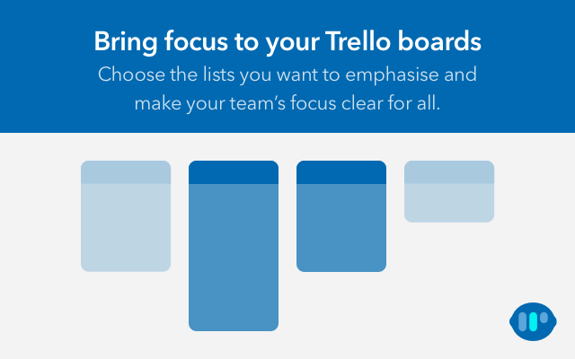

[](http://makeapullrequest.com)
[](#contributors)
[](https://github.com/tgallacher/focali-for-trello/graphs/commit-activity)
[](https://travis-ci.com/tgallacher/focali-for-trello)
[](https://coveralls.io/github/tgallacher/focali-for-trello?branch=master)

<p align="center">
  
</p>

# Focali for Trello

Google Chrome extension for sharpening focus on (busy) [Trello](https://trello.com) boards.


## Install

Install from the [Chrome Web Store](#). (TODO)

## Develop

```sh
yarn install

# Available in http://localhost:6006
# Test the popup.html UI
yarn storybook

# Auto rebuild on changes
yarn build:dev --watch
```

Then use the Chrome extensions in "developer mode" and load the unpacked extension. Simply refresh the extension when any files are changed, to see how the work in the browser.

> Note: Some parts of the extension rely on the `chrome` API and so can't be fully tested inside StorybookJS. Hence the workflow above.

## Contributors

Thanks goes to these wonderful people ([emoji key](https://allcontributors.org/docs/en/emoji-key)):

<!-- ALL-CONTRIBUTORS-LIST:START - Do not remove or modify this section -->
<!-- prettier-ignore -->
<table><tr><td align="center"><a href="https://commented.tech"><br /><sub><b>Tom Gallacher</b></sub></a><br /><a href="#ideas-tgallacher" title="Ideas, Planning, & Feedback">🤔</a> <a href="#maintenance-tgallacher" title="Maintenance">🚧</a> <a href="https://github.com/tgallacher/focali-for-trello/commits?author=tgallacher" title="Code">💻</a> <a href="https://github.com/tgallacher/focali-for-trello/issues?q=author%3Atgallacher" title="Bug reports">🐛</a> <a href="https://github.com/tgallacher/focali-for-trello/commits?author=tgallacher" title="Documentation">📖</a></td><td align="center"><a href="http://andrewsims.co"><br /><sub><b>Andrew Sims</b></sub></a><br /><a href="#design-andrew-sims" title="Design">🎨</a></td></tr></table>

<!-- ALL-CONTRIBUTORS-LIST:END -->

This project follows the [all-contributors](https://github.com/all-contributors/all-contributors) specification. Contributions of any kind welcome!
